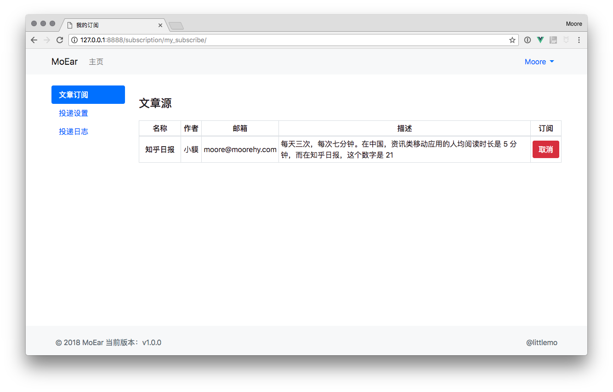
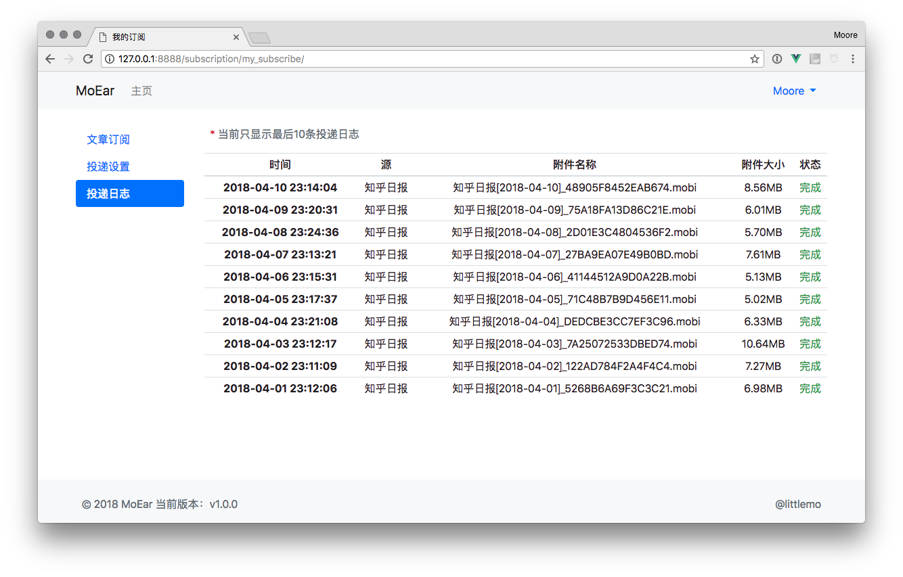
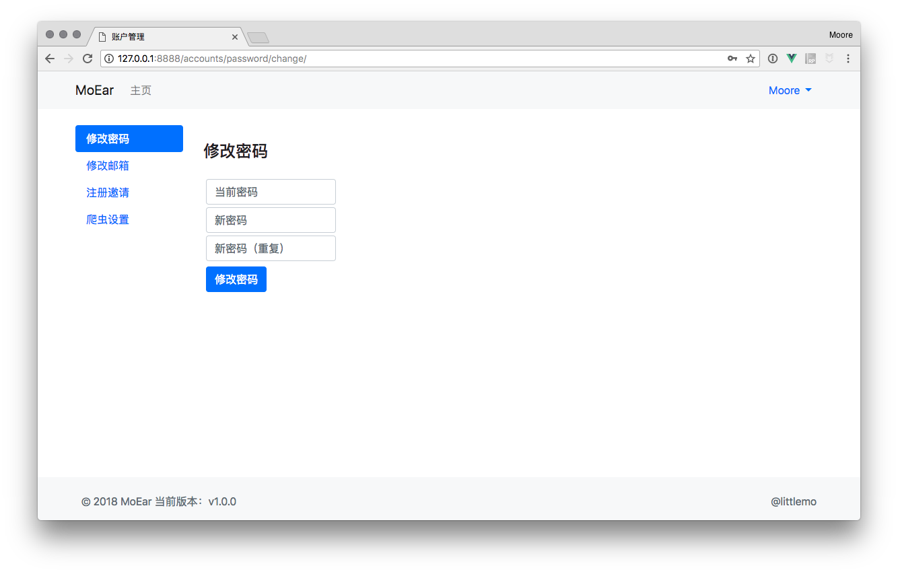
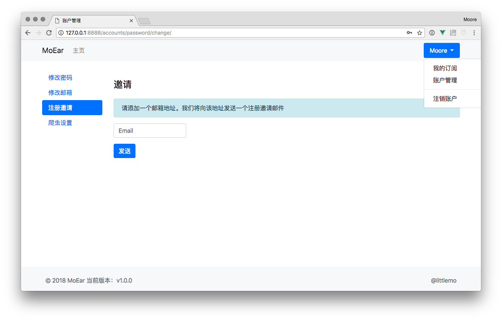
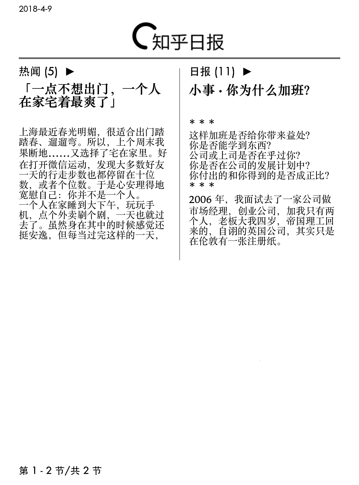
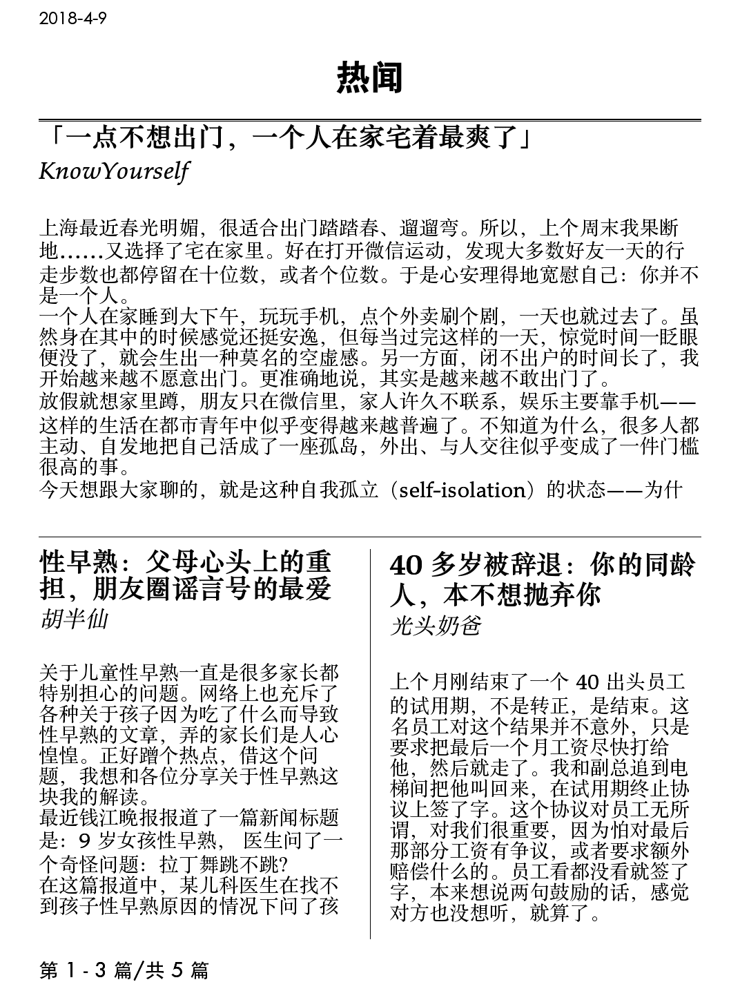
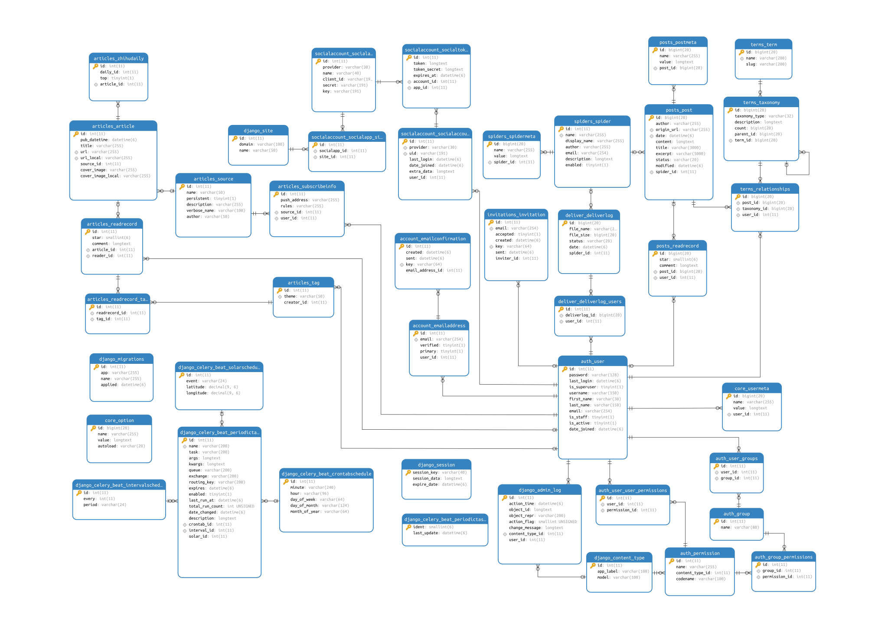

.. _intro-overview:

====
概览
====

截图展示
========

共分两部分，分别为 Web 端的站点管理后台，以及 Kindle 设备端的书籍显示效果

Web
---

.. image:: images/web/0-index.png
   :scale: 25 %

Kindle
------

.. _intro-overview-deployment:

部署说明
========

本项目实现了基于 `Docker`_ 的容器部署方式，如果您对 `Docker`_ 足够熟悉，相信您会感受到丝般顺滑。

如果您不是很了解 `Docker`_ ，强烈建议您学习一下，真的找不到比这个更赞的部署方案了（安利脸~~

环境搭建
--------

唯一需要的环境就是 `Docker`_ 以及 `docker-compose`_ ，关于 `Docker`_
我曾经参考官方文档编写过一个搭建教程，如果您是 Ubuntu 系统，可以参考一下
`《Ubuntu安装部署Docker》 <https://www.moorehy.com/archives/152>`_ ，
但是仍然更推荐您阅读 `docker官方安装文档 <https://docs.docker.com/install/>`_

`docker-compose`_ 的安装方法很多，您可以参考
`docker-compose官方安装文档 <https://docs.docker.com/compose/install/>`_

部署文件
--------

项目部署文件路径如下::

    .
    ├── docker-compose.yml
    ├── env
    │   └── moear.env
    └── volumes
        └── web
            └── config
                ├── db
                │   └── mysql.conf
                └── nginx
                    └── nginx.conf

下面将逐一介绍相应文件的配置方式，以及用例

docker-compose.yml
~~~~~~~~~~~~~~~~~~

该文件为 ``docker`` 的装配文件，基本不需要修改，直接在目标服务器中的项目路径下创建即可。

创建路径::

    $ mkdir -p path/to/project
    $ touch docker-compose.yml

将下列内容写入到 ``docker-compose.yml`` 文件中::

    version: '2'
    services:
      moear:
        image: littlemo/moear
        container_name: moear-server
        hostname: moear-server
        restart: unless-stopped
        ports:
          - "8888:8000"
        networks:
          - frontend
          - backend
        volumes:
          # 挂载运行时路径（其中包含日志、归集的静态文件）
          - ./volumes/runtime:/app/runtime:rw
          - ./volumes/runtime/log/nginx:/var/log/nginx:rw

          # 挂载扩展插件路径，仅支持 wheels 格式的 Python 包
          - ./volumes/plugin:/app/requirements/wheels:ro

          # 挂载配置文件
          - ./volumes/web/config/db/mysql.conf:/app/server/server/config/db/mysql.conf:ro
          - ./volumes/web/config/nginx/nginx.conf:/etc/nginx/nginx.conf:ro
        env_file:
          - env/moear.env
        depends_on:
          - mysql
          - redis

      redis:
        image: redis:alpine
        container_name: moear-redis
        hostname: moear-redis
        restart: unless-stopped
        networks:
          - backend
        volumes:
          # 数据库数据文件路径
          - ./volumes/redis/data:/data

      mysql:
        image: mysql
        container_name: mysql
        restart: unless-stopped
        volumes:
          - ./volumes/conf.d:/etc/mysql/conf.d:ro         # my.cnf 之后，额外的配置文件，用于覆盖 my.cnf 中的配置项
          - ./volumes/initdb:/docker-entrypoint-initdb.d  # 用于初始化数据库时执行的 .sh, .sql & .sql.gz
          - ./volumes/datadir:/var/lib/mysql              # 数据库数据文件路径
        networks:
          - backend
        environment:
          MYSQL_ROOT_PASSWORD: root_pwd
          MYSQL_DATABASE: moear
          MYSQL_USER: moear
          MYSQL_PASSWORD: moear_pwd
          character-set-server: utf8mb4
          collation-server: utf8mb4_unicode_ci
          TZ: Asia/Shanghai
        entrypoint: docker-entrypoint.sh

    networks:
      frontend:
      backend:

.. attention::

    该配置文件会在启动时创建一个 ``MySQL`` 实例，并创建指定的数据库、用户、密码，
    如果您有需要可以自行修改数据库配置

moear.env
~~~~~~~~~

此文件为 `docker` 具体容器实例中的环境变量，配置如下::

    # General
    SERVER_SETTINGS=server.settings
    SECRET_KEY=adb7t$a%t_sxb5lji=lxr&%q$3)@1rk_%wi#t!@7zy^17k7iua
    ALLOWED_HOSTS=localhost,127.0.0.1

    # Tips: 该逻辑会在安装时执行创建超级管理员用户，若目标用户已存在，则仅执行密码修改操作
    ADMIN_USERNAME=admin
    ADMIN_EMAIL=
    ADMIN_PASSWORD=whoisyourdaddy

    # EMAIL
    EMAIL_HOST=
    EMAIL_PORT=
    EMAIL_HOST_USER=
    EMAIL_HOST_PASSWORD=
    EMAIL_USE_SSL=
    EMAIL_TIME_LIMIT=30

    DEFAULT_FROM_EMAIL=

    # Switch
    DEBUG=False
    PRODUCTION=True

    # Celery
    CELERY_BROKER_URL=redis://moear-redis:6379/0
    CELERY_RESULT_BACKEND=redis://moear-redis:6379/0
    CELERY_WORKER_CONCURRENCY=2
    CELERY_WORKER_CONCURRENCY_EMAIL=1
    CELERY_WORKER_CONCURRENCY_CRAWL=1
    CELERY_WORKER_PREFETCH_MULTIPLIER=1

    CELERY_BEAT_LOG_LEVEL=INFO
    CELERY_BEAT_LOG_FILE=/app/runtime/log/celery/celeryd.log
    CELERY_WORKER_LOG_LEVEL=INFO
    CELERY_WORKER_LOG_FILE=/app/runtime/log/celery/%n%I.log

留空的配置需要您填入，另外需重点关注的配置项说明如下

SECRET_KEY
    需修改为一个随机值，如果您不修改，站点安全性将大大下降

ALLOWED_HOSTS
    如果您需要使用域名访问的话，需要将其添加到此处，多个允许值可使用 ``,`` 连接

ADMIN_USERNAME / ADMIN_EMAIL / ADMIN_PASSWORD
    管理员账户配置，用户名&密码可按您需求修改

EMAIL_HOST / EMAIL_PORT / EMAIL_HOST_USER / EMAIL_HOST_PASSWORD / EMAIL_USE_SSL / DEFAULT_FROM_EMAIL
    邮件服务器配置，这是必须的，不然启动后服务器无法向您的管理员账户发送验证邮件，
    且无法向您的 Kindle 发送投递邮件

mysql.conf
~~~~~~~~~~

数据库配置文件如下::

    [client]
    host = mysql
    database = moear
    user = moear
    password = moear_pwd
    default-character-set = utf8mb4

.. attention::

    若您在之前的 ``docker-compose.yml`` 的 **MySQL** 配置中修改了数据库配置，
    此处需做相应修改，若未修改，则可直接使用

nginx.conf
~~~~~~~~~~

此文件是最应该被优化掉得，由于我没有找到一个好的低成本设置 ``Nginx.conf`` 中 **server_name**
字段值的方式，故此处为保证 ``Nginx`` 可以正常处理外部请求中的 **host** 需添加配置如下::

    worker_processes 3;

    user root root;
    # 'user nobody nobody;' for systems with 'nobody' as a group instead
    pid /tmp/nginx.pid;
    error_log /app/runtime/log/nginx/nginx.error.log;

    events {
      worker_connections 1024; # increase if you have lots of clients
      accept_mutex on; # set to 'on' if nginx worker_processes > 1
      use epoll; # to enable for Linux 2.6+
      # 'use kqueue;' to enable for FreeBSD, OSX
    }

    http {
      include mime.types;
      default_type application/octet-stream;
      access_log /app/runtime/log/nginx/nginx.access.log combined;
      sendfile on;

      upstream app_server {
        # fail_timeout=0 means we always retry an upstream even if it failed
        # to return a good HTTP response

        # for UNIX domain socket setups
        # server unix:/tmp/gunicorn.sock fail_timeout=0;

        # for a TCP configuration
        server 127.0.0.1:8000 fail_timeout=0;
      }

      server {
        listen 80 default_server;
        return 444;
      }

      server {
        listen 80;
        client_max_body_size 4G;

        # set the correct host(s) for your site
        server_name localhost;

        keepalive_timeout 5;

        # path for static files
        location /static/ {
            root /;
            rewrite ^/static/(.*)$ /app/runtime/static/$1 break;
            access_log off;
        }

        location / {
          try_files $uri @proxy_to_app;
        }

        location @proxy_to_app {
          proxy_set_header X-Forwarded-For $proxy_add_x_forwarded_for;
          proxy_set_header Host $http_host;
          proxy_redirect off;
          proxy_pass http://app_server;
        }
      }
    }

将 ``server_name localhost;`` 修改为您的相应域名即可，多值可通过空格间隔

.. todo::

    此处配置极度不够优雅，一定要找到更优雅的解决方案把这步毙掉！哼(ˉ(∞)ˉ)唧

构建容器
--------

完成上述准备工作后，构建容器就很简单了， ``docker-compose`` 的基础操作::

    $ cd path/to/project
    $ docker-compose up -d

另外， ``docker-compose`` 还支持很多实用的运维工具，您可以自行了解学习

剩下的就是用浏览器访问站点( ``http://127.0.0.1:8888`` )，完成账号的邮箱认证，执行文章订阅，
以及配置 Kindle 收件地址等操作了，此处不再一一赘述

.. hint::

    列出几个常用命令::

        $ docker-compose stop   # 停止服务
        $ docker-compose start  # 启动服务
        $ docker-compose down   # 销毁容器
        $ docker-compose up     # 构建容器

系统设计
========

.. hint:: 下图中除了 ``deliver`` 其他实体都是可点击的哦，会在新标签页中打开相应的包文档页。

.. mermaid::
   :caption: 系统架构设计图
   :align: center

   graph TB
        MoEar -->|发送任务| Celery((Celery))
        Celery -->|抓取任务<定时>| spider[moear.spider]
        Celery -->|打包任务| package[moear.package]
        Celery -->|投递任务| deliver
        subgraph 邮件系统
        deliver
        end
        subgraph stevedore
            spider
            package
        end
        subgraph moear-api-common
            zhihu[moear-spider-zhihudaily]
            mobi[moear-package-mobi]
        end
        spider -->|爬虫插件| zhihu
        package -->|打包插件| mobi

        click MoEar "http://moear.rtfd.io"
        click Celery "http://docs.celeryproject.org"
        click spider "http://moear-api-common.rtfd.io"
        click package "http://moear-api-common.rtfd.io"
        click zhihu "http://moear-spider-zhihudaily.rtfd.io" "知乎日报"
        click mobi "http://moear-package-mobi.rtfd.io" "mobi"

.. hint::

    抓取与打包功能均以插件形式实现，便于扩展和替换，投递系统由于比较固定，于是实现在了主服务中。

.. todo::

    关于投递系统，为实现节省流量的目的，实现时做了合并投递，即多人订阅了同一个文章源，
    会在该文章当日爬取后合并为一封邮件，加入多个收件地址的形式进行投递。小规模情况下测试正常，
    没有问题，但作者在网上(非官网)看到了一些 Kindle 的投递限制，由于不便测试，故先记录在下:

    #. 一份邮件超过15个不同的【发送至Kindle】电子邮箱，会被认定为垃圾邮件而被Amazon拒绝接收
    #. 附加大于50MB会投递失败

    以上两点未经确认，故暂不为其做应对处理

    其实第二点是可以测试的，但一般情况下应该遇不到这么大的文章，而且吧。懒。。懒。。。（溜了

模型设计
========

.. hint:: 下图为 ``SVG`` 的矢量图，点击可放大查看

.. hint:: 具体数据模型字段信息，可查看相应应用 ``models`` 中的定义，此处不再赘述

.. note::

    从模型 ER 图中您也可以看出，原本设计的功能很多，但考虑到开发周期，目前只实现了最核心的功能。
    关于文章管理、分类系统等，会在之后版本中陆续实现，但愿不会烂尾（羞~

捐赠
====

来杯咖啡可好~~ **⁄(⁄ ⁄•⁄ω⁄•⁄ ⁄)⁄**

.. _Docker: https://docs.docker.com/
.. _docker-compose: https://docs.docker.com/compose/
